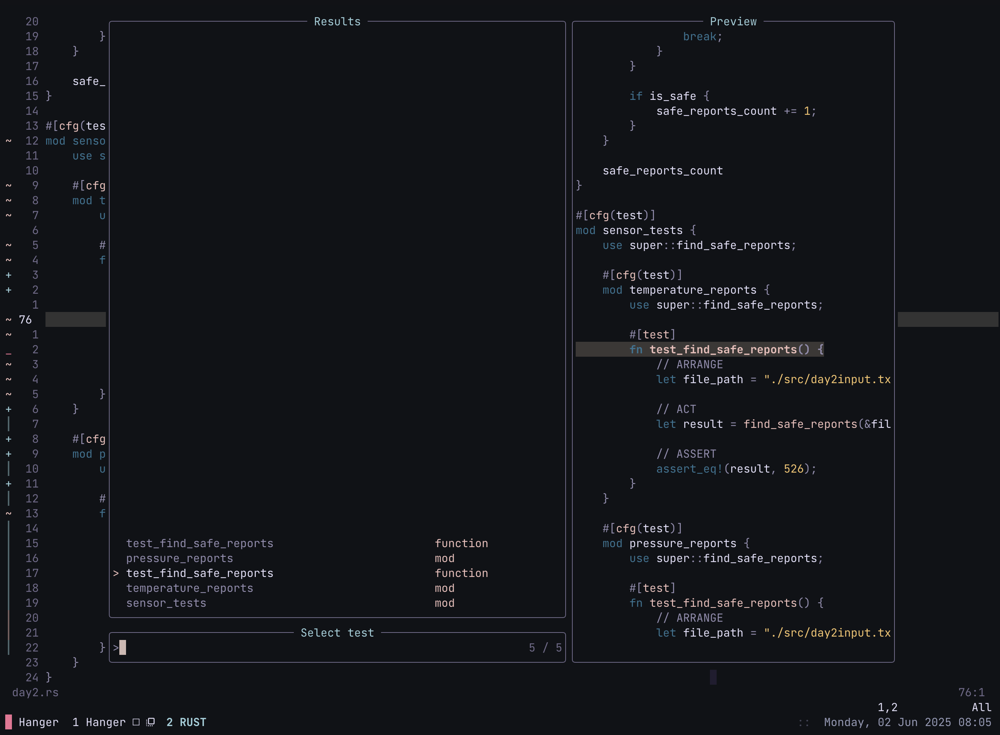
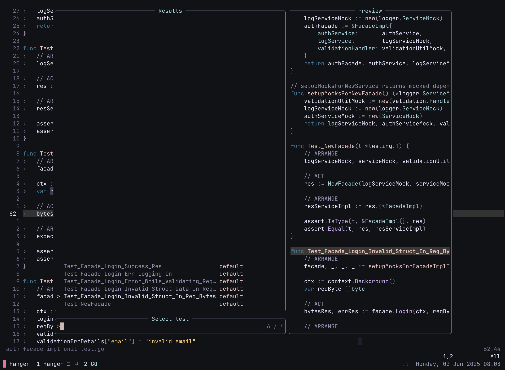
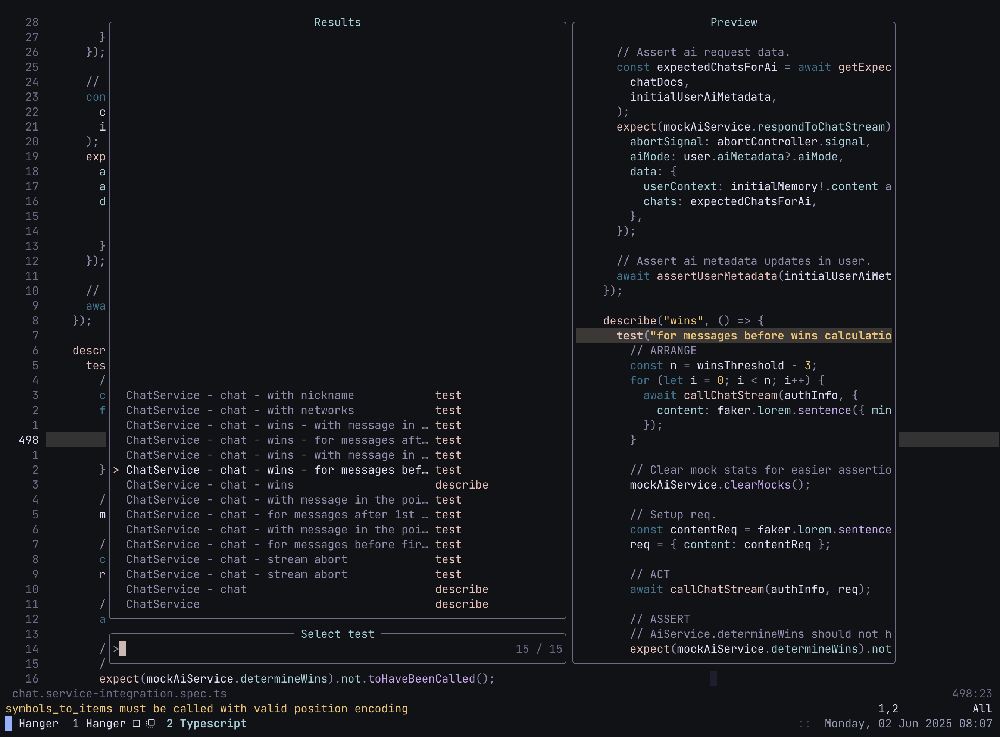
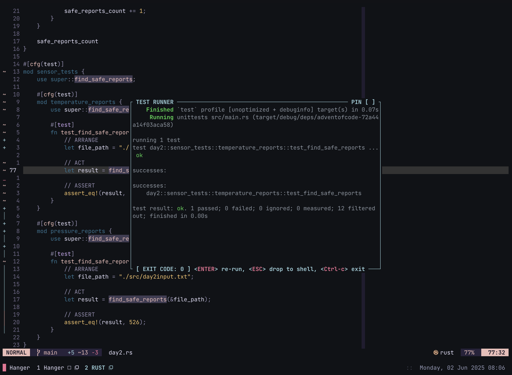

# Neovim Test Runner Plugin

Hanger.nvim is a lightweight and intuitive Neovim plugin for running and managing tests in Rust, Go, and JavaScript/TypeScript projects. Powered by Tree-sitter, it detects tests intelligently and provides a fast, editor-native workflow tailored for rapid iteration.

Run tests directly from Neovim — in the built-in terminal or a floating Zellij pane — without breaking focus. With minimal setup and simple commands, you can instantly run the test under your cursor, browse all tests in the current file, or rerun the last executed test — perfect for tight feedback loops and fast development cycles.

## Features
- 🧠 Tree-sitter powered test detection
- 🔍 Telescope UI for discovering & running tests
- 🚀 One-shot test execution under cursor
- 🧪 Language support:
  - **Rust** (`cargo test`) with a custom runner
  - **Go** (`go test`, `testify`) with suite-aware execution
  - **JavaScript** (`jest`) with precise control
- 🪟 Run in:
  - Neovim terminal (default)
  - Floating **Zellij** pane (optional)
  - _tmux support coming soon_

<p align="center">
  
  
</p>
<p align="center">
  
  
</p>

## Requirements
- [nvim-telescope/telescope.nvim](https://github.com/nvim-telescope/telescope.nvim) – Popup UI for selecting test functions.
- [nvim-lua/plenary.nvim](https://github.com/nvim-lua/plenary.nvim) – Required by Telescope.
- [nvim-treesitter/nvim-treesitter](https://github.com/nvim-treesitter/nvim-treesitter) – Used for parsing Go test functions.
- **Rust Analyzer** – Required for running Rust tests (`rust-analyzer` must be installed and configured in Neovim).

## Installation

Use your preferred plugin manager to install the plugin.

### Using Lazy
```lua
{
    'https://github.com/pjmessi/hanger',
    lazy = false,
    cmd = { "RunTest", "ReRunTest", "RunAllTests", "ShowTests" },
    dependencies = {
      "nvim-telescope/telescope.nvim",
      "nvim-lua/plenary.nvim",
      "nvim-treesitter/nvim-treesitter",
    },
    config = function()
      require("hanger").setup({
        -- options: 'term' / 'zellij'
        output = "zellij",
        -- only valid for 'zellij' 'output'
        floating_pane = true,
      })

      vim.api.nvim_set_keymap('n', '<leader>rt', ':RunTest<CR>',
        { desc = '[R]un [T]est', noremap = true, silent = true })
      vim.api.nvim_set_keymap('n', '<leader>rrt', ':ReRunTest<CR>',
        { desc = '[R]e [R]un [T]est', noremap = true, silent = true })
      vim.api.nvim_set_keymap('n', '<leader>rat', ':RunAllTests<CR>',
        { desc = "[R]un [A]ll [T]ests", noremap = true, silent = true })
      vim.api.nvim_set_keymap('n', '<leader>st', ':ShowTests<CR>',
        { desc = '[S]how [T]ests', noremap = true, silent = true })
    end,
  }
```

## Coming Soon
Support for additional programming languages will be added in future releases.

