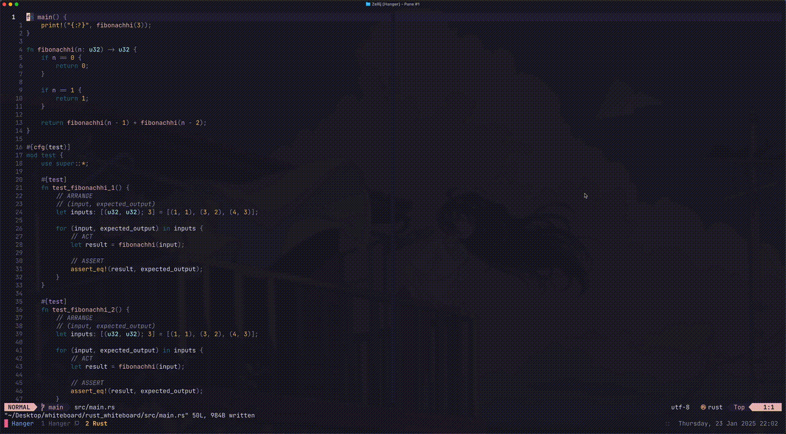
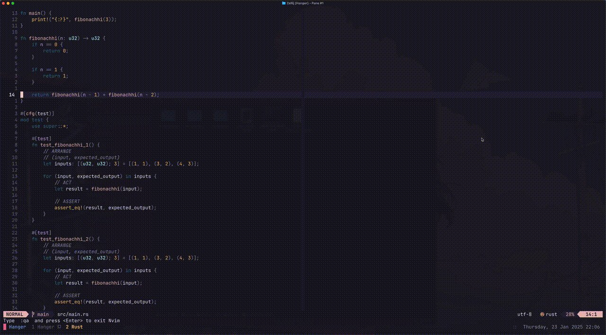

# Neovim Test Runner Plugin

A lightweight Neovim plugin that provides APIs to run and manage tests for Rust and Go projects. This plugin integrates seamlessly with Zellij or Neovim's terminal to execute test commands in a new floating pane.

## Features

- **RunSingleTest**: Executes a single test function where the cursor is currently located.
- **RunFileTests**: Runs all tests in the current file or package.
- **RerunTest**: Re-executes the last test that was run, regardless of cursor position. Ideal for quickly iterating on tests without needing to manually locate the test function in the file again.

## Requirements

- **Neovim**: Version 0.8 or higher.
- **Zellij**: For creating floating panes (optional if using Neovim terminal).
- **Rust**: `cargo` for test execution.
- **Go**: `go test` for test execution.

## Installation

Use your preferred plugin manager to install the plugin.

### Using Lazy
```lua
{
    dir = "https://github.com/PJMessi/hanger",
    lazy = false,
    cmd = { "RunSingleTest", "RerunSingleTest", "RunFileTests" },
    config = function()
      require("hanger").setup({
        output = "term",      -- options: 'term' / 'zellij'
        floating_pane = false, -- only valid for 'zellij' 'output'
      })

      vim.api.nvim_set_keymap('n', '<leader>rt', ':RunSingleTest<CR>', { noremap = true, silent = true })
      vim.api.nvim_set_keymap('n', '<leader>rrt', ':RerunTest<CR>', { noremap = true, silent = true })
      vim.api.nvim_set_keymap('n', '<leader>rft', ':RunFileTests<CR>', { noremap = true, silent = true })
    end,
}
```

## Coming Soon
Support for additional programming languages will be added in future releases. Stay tuned for more!


## Demo Videos
## Demo GIFs

### RunSingleTest Demo


### RunFileTests Demo

